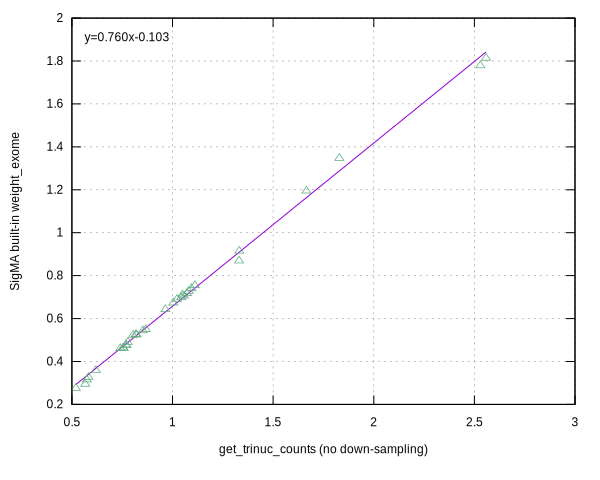

# Introduction

C implementation of [get_trinuc_norm.R](https://github.com/parklab/SigMA/blob/master/R/get_trinuc_norm.R) based up [kmer-cnt](https://github.com/lh3/kmer-cnt) and [cgranges](https://github.com/lh3/cgranges). The only library dependency is [zlib](https://www.zlib.net).

1. Features
    * Very fast
    * No region sampling for WES or WGS
    * WGS sig3 calculation on the fly

2. How to compile

    ```
    cd src
    make
    ```

3. Usage

    ```
    get_trinuc_counts -b panel_or_WES.bed -o sig3_norm_scale.tsv reference.fa
    ```

4. WES run

    * WES target region size calculated with [bedtk](https://github.com/lh3/bedtk)

        ```
        bedtk sort seqcap_capture_b37.bed | bedtk merge | bedtk sum
        63959731
        ```

    * Get trinucleotide counts (normalized)

        ```
        time get_trinuc_counts -b seqcap_capture_b37.bed -o seqcap_capture_b37.norm $hs37
        
        real	4m12.611s
        user	4m2.172s
        sys	0m7.739s
        ```

5. Output

<details>
    <summary>seqcap_capture</summary>

```
###	get_trinuc_counts	weight_exome_built_in(added for comparison)
ACA	0.771240	0.4756647
ACC	1.048125	0.7111515
ACG	1.665498	1.1954055
ACT	0.768453	0.4775805
CCA	1.022236	0.6905215
CCC	1.330937	0.8697183
CCG	2.557945	1.8140354
CCT	1.056723	0.7058424
GCA	1.043128	0.6986927
GCC	1.331598	0.9152037
GCG	2.529302	1.7790112
GCT	1.093794	0.7414501
TCA	0.816880	0.5255657
TCC	1.071820	0.7180832
TCG	1.828886	1.3478038
TCT	0.821520	0.5253713
ACA	0.771240	0.4756647
ACC	1.048125	0.7111515
ACG	1.665498	1.1954055
ACT	0.768453	0.4775805
CCA	1.022236	0.6905215
CCC	1.330937	0.8697183
CCG	2.557945	1.8140354
CCT	1.056723	0.7058424
GCA	1.043128	0.6986927
GCC	1.331598	0.9152037
GCG	2.529302	1.7790112
GCT	1.093794	0.7414501
TCA	0.816880	0.5255657
TCC	1.071820	0.7180832
TCG	1.828886	1.3478038
TCT	0.821520	0.5253713
ACA	0.771240	0.4756647
ACC	1.048125	0.7111515
ACG	1.665498	1.1954055
ACT	0.768453	0.4775805
CCA	1.022236	0.6905215
CCC	1.330937	0.8697183
CCG	2.557945	1.8140354
CCT	1.056723	0.7058424
GCA	1.043128	0.6986927
GCC	1.331598	0.9152037
GCG	2.529302	1.7790112
GCT	1.093794	0.7414501
TCA	0.816880	0.5255657
TCC	1.071820	0.7180832
TCG	1.828886	1.3478038
TCT	0.821520	0.5253713
ATA	0.519402	0.2759440
ATC	0.804258	0.5233615
ATG	0.777810	0.4904268
ATT	0.573957	0.3152586
CTA	0.619226	0.3598444
CTC	1.003768	0.6732809
CTG	1.110929	0.7544566
CTT	0.867327	0.5504704
GTA	0.754145	0.4648557
GTC	1.080496	0.7284736
GTG	0.964731	0.6429367
GTT	0.758002	0.4611863
TTA	0.566187	0.2952764
TTC	0.852278	0.5445673
TTG	0.740317	0.4611112
TTT	0.582413	0.3261839
ATA	0.519402	0.2759440
ATC	0.804258	0.5233615
ATG	0.777810	0.4904268
ATT	0.573957	0.3152586
CTA	0.619226	0.3598444
CTC	1.003768	0.6732809
CTG	1.110929	0.7544566
CTT	0.867327	0.5504704
GTA	0.754145	0.4648557
GTC	1.080496	0.7284736
GTG	0.964731	0.6429367
GTT	0.758002	0.4611863
TTA	0.566187	0.2952764
TTC	0.852278	0.5445673
TTG	0.740317	0.4611112
TTT	0.582413	0.3261839
ATA	0.519402	0.2759440
ATC	0.804258	0.5233615
ATG	0.777810	0.4904268
ATT	0.573957	0.3152586
CTA	0.619226	0.3598444
CTC	1.003768	0.6732809
CTG	1.110929	0.7544566
CTT	0.867327	0.5504704
GTA	0.754145	0.4648557
GTC	1.080496	0.7284736
GTG	0.964731	0.6429367
GTT	0.758002	0.4611863
TTA	0.566187	0.2952764
TTC	0.852278	0.5445673
TTG	0.740317	0.4611112
TTT	0.582413	0.3261839
```
</details>


May be the built-in `weight_exome` is down-sampled from seqcap manifest, while the concordance with the get_trinuc_counts results is high.

[]()
